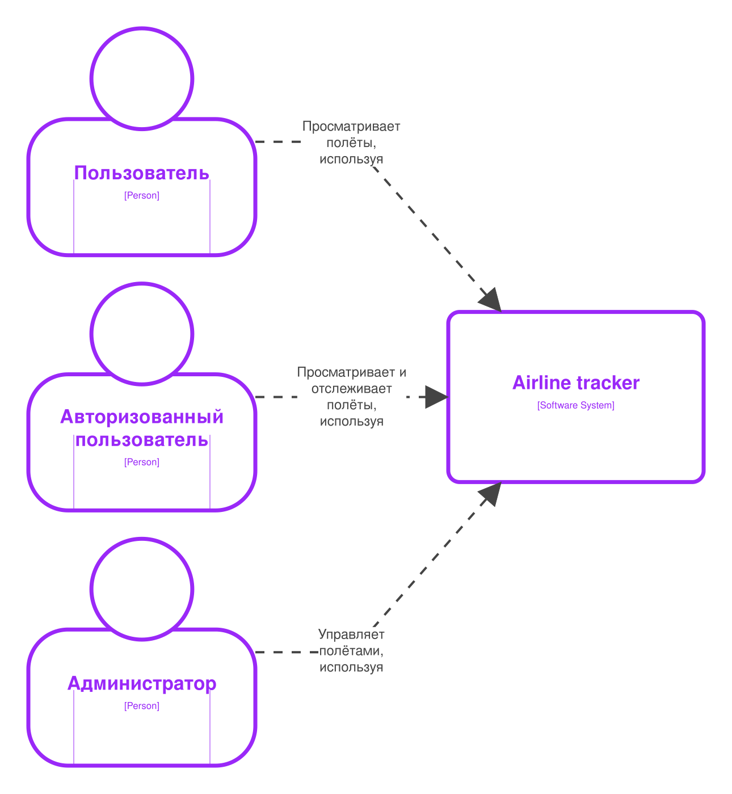
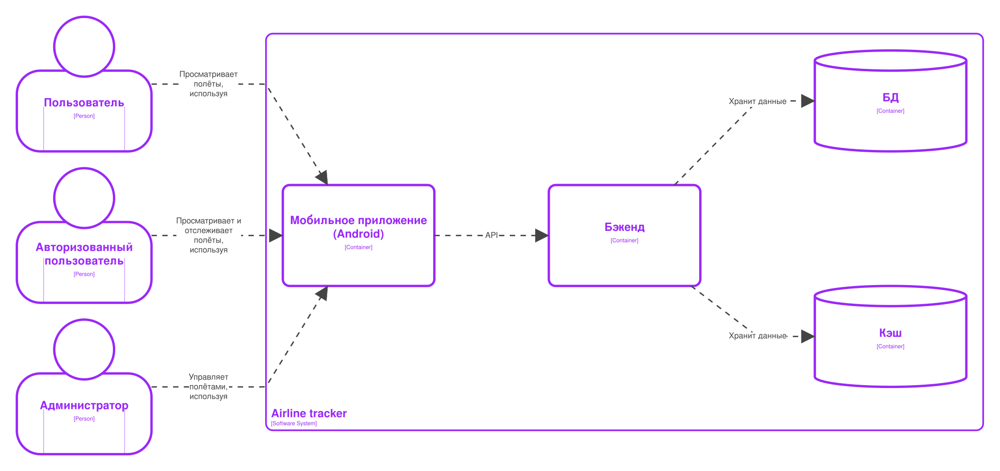
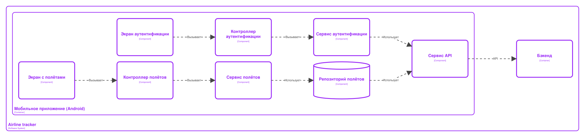
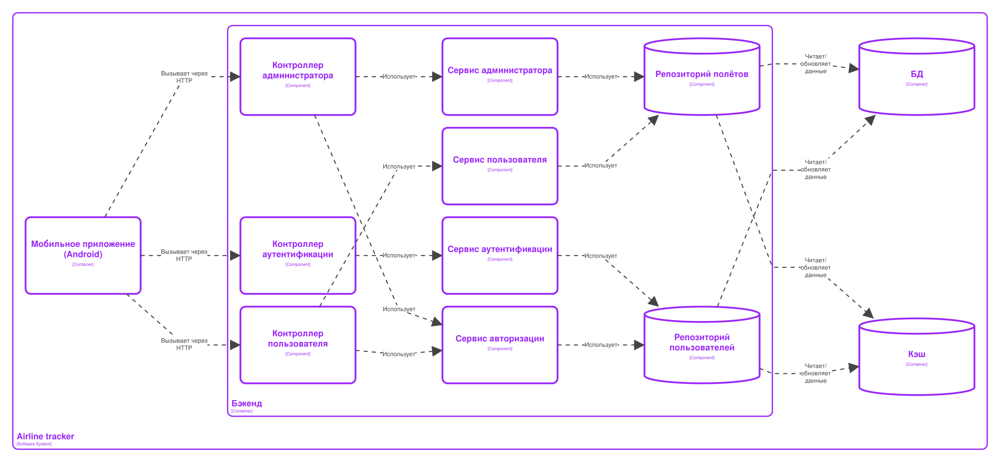
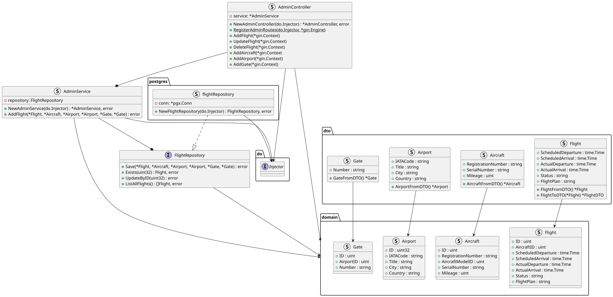
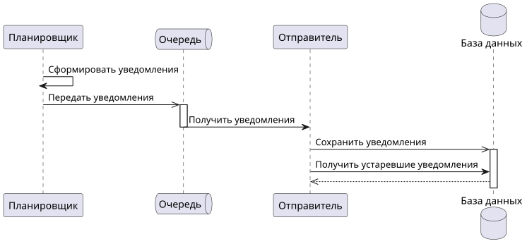

# Airline tracker

## Идея проекта
Приложение позволяет просматривать данные о
полётах авиакомпании. Пользователь может
подписаться на полёт и получать уведомления и
доп. информацию о полёте.
Уведомления:
1. За 15 минут до вылета
1. На сколько задержится рейс

## Описание предметной обасти
Предметная область: оповещение пользователей
о статусе полёта.
Сущности:
- Администратор
- Уведомление
- Пользователь
- Аэропорт
- Выход на посадку
- Модель самолёта
- Самолёт
- Полёт

## Существующие решения
| Решение | Оповещение о полёте | Информация о задержках | Просмотр рейсов |
| :---: | :---: | :---: | :---: |
| Wanderlog | - | + | + |
| FlightStats | - | - | + |
| Flightradar24 | - | + | + |

## Актуальность и целесообразность
Целесообразность --- проект позволит выполнить лабораторные
работы в рамках курса проектирования ПО.
Актуальность --- решение позволит получать необходимую
информацию об авиарейсах.

## Акторы (роли)
1. Пользователь
1. Администратор
1. Авторизированный пользователь

---

## Тип приложения
Mobile (Android)

## C4

## Диаграмма последовательностей

