# Airline Tracker

Airline Tracker — система для просмотра рейсов и отслеживания изменений в их расписании. Она объединяет публичный каталог рейсов, личные подписки пассажиров и интерфейс администратора для управления аэропортами, воздушными судами и рейсами. При изменении рейса система формирует уведомления для подписанных пользователей и асинхронно отправляет их по электронной почте.

## Цель работы

Цель проекта — сократить время между изменением оперативной информации о рейсе и получением этой информации пассажиром. Система предоставляет единый источник сведений о рейсах, позволяет пользователю подписаться на интересующий рейс, а администратору — поддерживать расписание и справочники в актуальном состоянии.

## Требования

### Функциональные требования

- любой посетитель может просматривать список рейсов, сведения об аэропортах и подробности выбранного рейса;
- пользователь может зарегистрироваться, войти в систему и выйти из неё;
- авторизованный пользователь может подписаться на рейс и просматривать свои подписки;
- администратор может создавать аэропорты, выходы на посадку, модели самолётов, самолёты и рейсы;
- администратор может изменять расписание, фактическое время, статус и план рейса;
- при создании подписки и изменении рейса система формирует уведомление и доставляет его пользователю по электронной почте;
- система проверяет целостность маршрута: существование самолёта, аэропортов и выходов, различие аэропортов вылета и прилёта и корректный порядок времени вылета и прилёта.

### Ключевые нефункциональные требования

Указанные значения являются критериями приёмки и требуют отдельного нагрузочного и эксплуатационного тестирования.

| Категория | Измеримое требование |
|---|---|
| Производительность | Для `GET /api/v1/flights` и `GET /api/v1/airports` 95-й перцентиль времени ответа не должен превышать 500 мс при нагрузке 100 запросов в секунду после прогрева кэша. |
| Надёжность | Не менее 99,5% доступности за календарный месяц; неотправленные события должны сохраняться в таблице `outbox` и повторно обрабатываться после восстановления Kafka с интервалом опроса не более 1 секунды. |
| Безопасность | 100% операций пользователя и администратора должны отклонять запрос без действительного JWT и требуемой роли; срок действия JWT — не более 15 минут, пароли хранятся только как bcrypt-хэши. |

## Пользовательские сценарии

### 1. Просмотр рейсов

**Актор:** посетитель.

**Предусловие:** приложение доступно.

**Основной поток:** посетитель открывает приложение → система загружает аэропорты и рейсы → посетитель использует поиск и выбирает рейс → система показывает маршрут, расписание и текущий статус.

**Результат:** посетитель получает актуальную информацию без обязательной авторизации.

### 2. Подписка на рейс

**Актор:** зарегистрированный пользователь.

**Предусловие:** пользователь авторизован, рейс существует.

**Основной поток:** пользователь выбирает рейс → нажимает кнопку подписки → API проверяет пользователя и рейс → создаёт уникальную подписку → сохраняет событие в `outbox` → уведомление передаётся через Kafka в сервис уведомлений.

**Альтернативы:** при недействительном токене возвращается `401`; при отсутствии пользователя или рейса — `404`; повторная подписка не создаёт дубликат.

**Результат:** рейс появляется в списке подписок пользователя.

### 3. Создание рейса

**Актор:** администратор.

**Предусловие:** администратор авторизован; самолёт, аэропорты и соответствующие выходы существуют.

**Основной поток:** администратор заполняет форму → система проверяет роль и входные данные → проверяет маршрут и время → сохраняет рейс и его маршрут → возвращает подтверждение создания.

**Альтернативы:** система отклоняет запрос, если аэропорты совпадают, сущности не существуют, выход не относится к выбранному аэропорту или прилёт запланирован раньше вылета.

**Результат:** новый рейс доступен в общем списке.

### 4. Изменение рейса и уведомление пассажиров

**Актор:** администратор; получатели — подписанные пользователи.

**Предусловие:** рейс существует, на него есть подписки.

**Основной поток:** администратор меняет расписание или статус → API обновляет данные и создаёт событие → издатель передаёт событие в Kafka → notifier сохраняет уведомления → отправитель доставляет письма и отмечает уведомления отправленными.

**Альтернатива:** если брокер временно недоступен, событие остаётся в `outbox` для следующей попытки.

**Результат:** подписчики получают сведения об изменении рейса.

## Диаграммы

### Use case

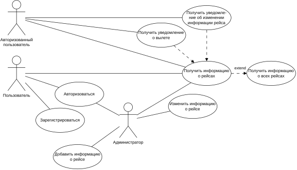

### BPMN и алгоритмы

#### Подготовка и отправка уведомлений

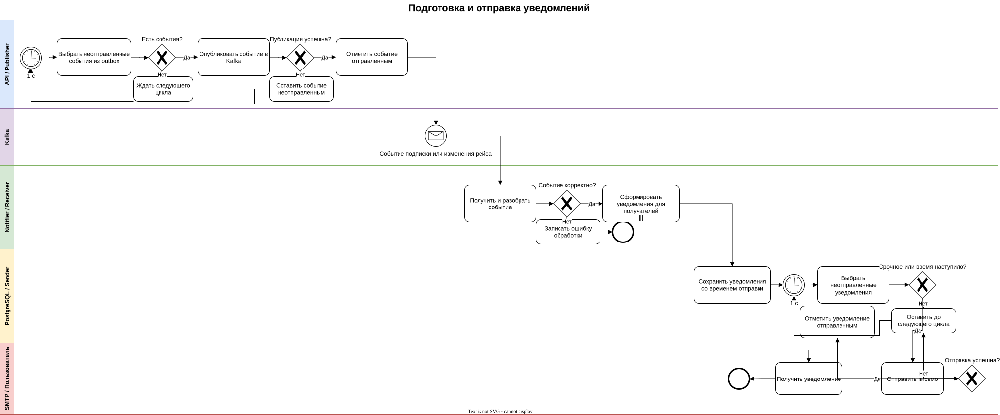

#### Управление рейсом

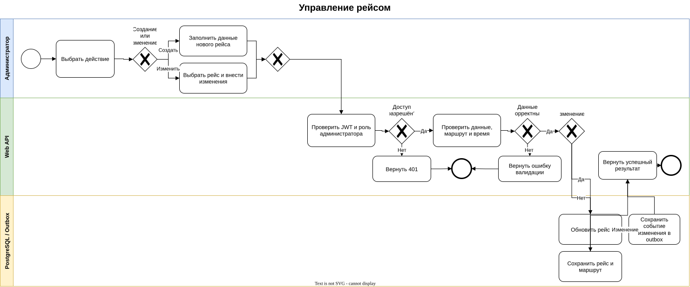

#### Подписка на рейс

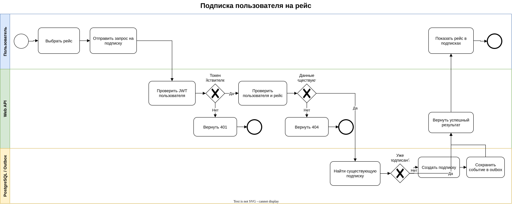

#### Пользовательские потоки

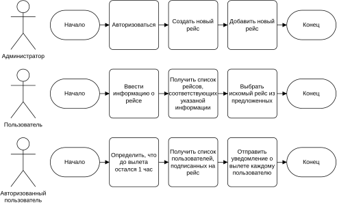

#### Алгоритм добавления рейса

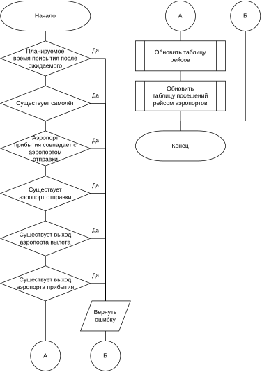

#### Алгоритм подписки на рейс

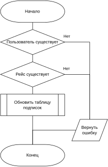

#### Последовательность обработки уведомления

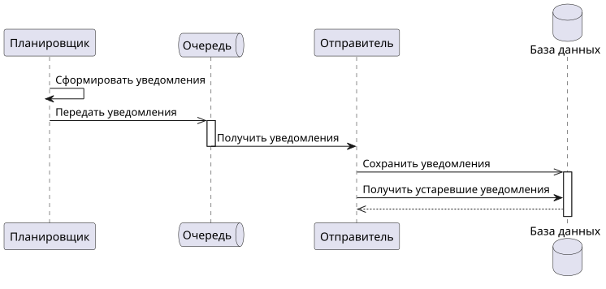

### Модель данных

#### ER-диаграмма предметной области

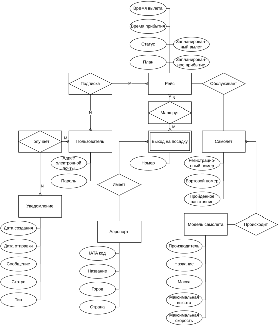

#### Физическая диаграмма базы данных

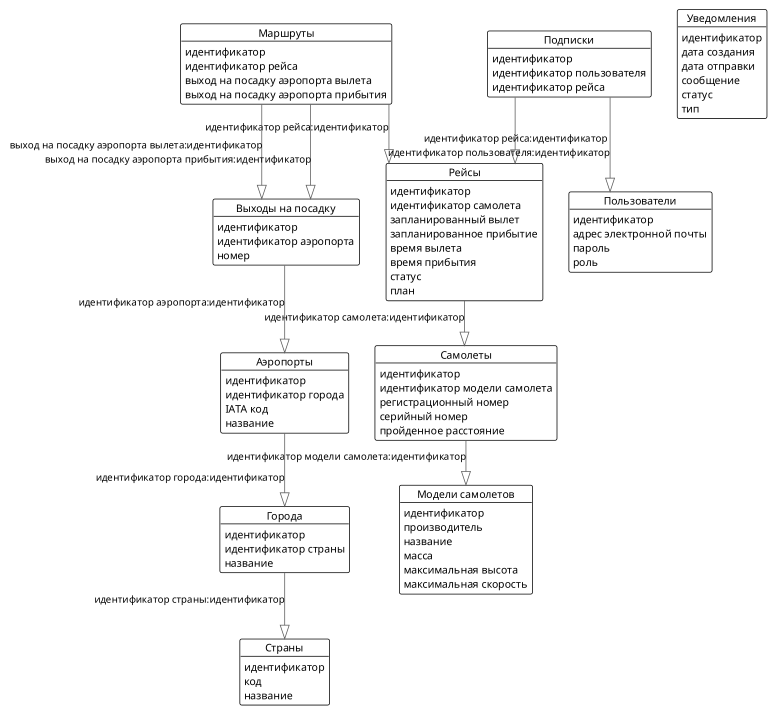

### C4

#### Уровень 1 — контекст системы

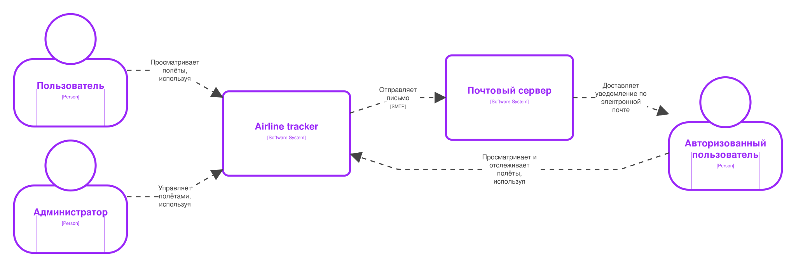

#### Уровень 2 — контейнеры

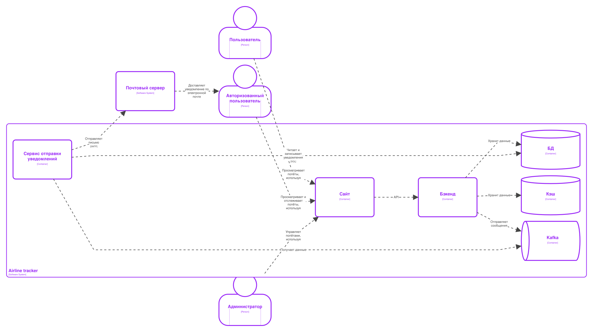

#### Уровень 3 — компоненты веб-клиента

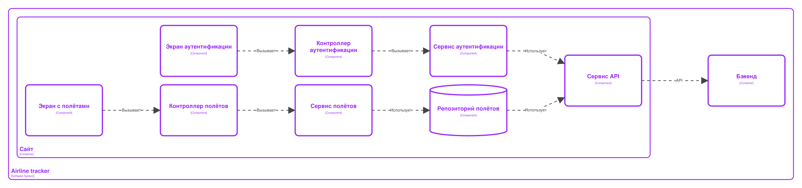

#### Уровень 3 — компоненты Backend API

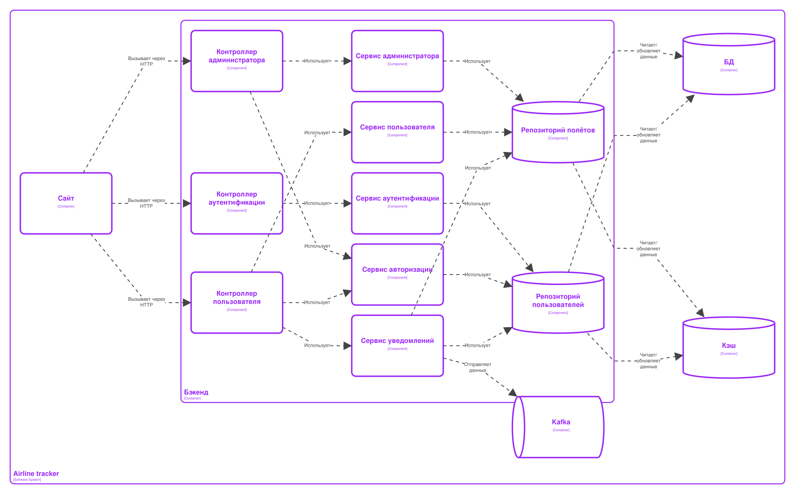

#### Уровень 3 — компоненты сервиса уведомлений

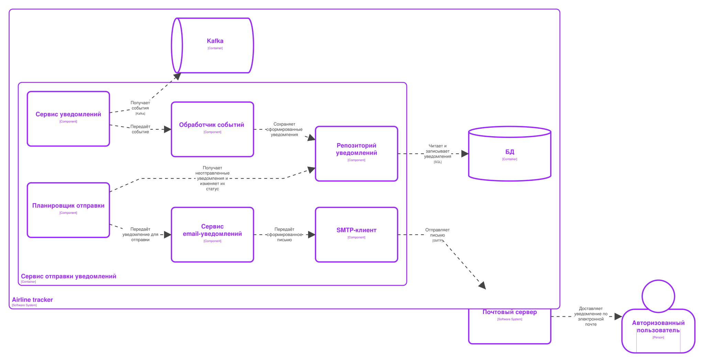

Дополнительная [диаграмма классов бэкенда (SVG)](docs/diagrams/class/class.svg) показывает основные доменные типы, DTO, репозитории, сервисы и контроллеры.

## Технологический стек

| Часть системы | Технологии |
|---|---|
| Backend API | Go 1.26, Gin, pgx, go-redis, Sarama, JWT, bcrypt, goose, swaggo |
| Сервис уведомлений | Go 1.26, Sarama, pgx, SMTP |
| Frontend | HTML5, CSS, JavaScript ES modules без клиентского фреймворка; Nginx как веб-сервер и reverse proxy |
| Хранение данных | PostgreSQL 16 — основные данные и outbox; Redis 7 — кэш рейсов |
| Обмен сообщениями | Apache Kafka — события подписки и изменения рейса |
| Доставка приложения | Многоэтапные Docker-образы, Docker Compose, Makefile; миграции запускаются отдельными контейнерами |
| Вспомогательные средства | Python — генерация тестовых данных; Swagger/OpenAPI — документация HTTP API |

## Архитектура

Решение состоит из статического веб-клиента, HTTP API и отдельного сервиса уведомлений. Nginx публикует клиент и проксирует `/api/` в API. API хранит основные данные в PostgreSQL, кэширует рейсы в Redis и записывает события в `outbox`. Фоновый издатель опрашивает outbox и передаёт события в Kafka. Notifier принимает события, сохраняет запланированные уведомления в PostgreSQL и отправляет их по SMTP.

### ADR-001: PostgreSQL как основное хранилище, Redis как кэш

**Решение.** Реляционные данные пользователей, аэропортов, воздушных судов, рейсов и подписок хранятся в PostgreSQL; Redis используется только для ускорения чтения и обновления данных о рейсах.

**Альтернативы.** Только PostgreSQL; документная БД; Redis как основное хранилище.

**Причины выбора.** Для предметной области важны внешние ключи, уникальность, ограничения значений и согласованное изменение связанных сущностей. PostgreSQL обеспечивает эти гарантии, а Redis снижает задержку часто выполняемого чтения, не становясь источником истины.

**Последствия.** Необходимо поддерживать согласованность кэша с PostgreSQL и предусматривать восстановление кэша после сбоя.

### ADR-002: асинхронные уведомления через outbox и Kafka

**Решение.** API сохраняет события подписки и изменения рейса в таблице `outbox`; фоновый издатель передаёт неотправленные записи в Kafka, а отдельный notifier планирует и отправляет письма.

**Альтернативы.** Синхронная SMTP-отправка внутри HTTP-запроса; непосредственная публикация в Kafka без промежуточного хранения; периодический поиск изменений в таблице рейсов.

**Причины выбора.** HTTP-запрос не зависит от скорости почтового сервера, компоненты API и отправки писем слабо связаны, а сохранённое событие можно повторно обработать после временной недоступности брокера.

**Последствия.** Доставка становится согласованной в конечном счёте; нужны идемпотентная обработка, мониторинг очереди и очистка обработанных записей. Текущая запись бизнес-данных и `outbox` ещё не объединена одной транзакцией, поэтому это ограничение следует устранить для полной гарантии доставки.

### ADR-003: веб-клиент без клиентского фреймворка

**Решение.** Интерфейс реализован на HTML, CSS и JavaScript-модулях и публикуется через Nginx.

**Альтернативы.** React, Vue или Angular; серверный рендеринг в Go.

**Причины выбора.** Интерфейс невелик, не требует сложного состояния и может поставляться как набор статических файлов без Node.js в runtime-образе.

**Последствия.** Сборка и доставка просты, но при росте интерфейса придётся вручную поддерживать маршрутизацию, компоненты и управление состоянием.

## Запуск

Необходимы GNU Make, Docker с плагином Docker Compose и заполненные файлы окружения:

- `backend/api/.env` и `backend/api/migrate.env`;
- `backend/notifier/.env` и `backend/notifier/migrate.env`;
- `utils/.env` — только для генератора тестовых данных.

Запуск приложения:

```bash
make release
```

После запуска веб-интерфейс доступен на <http://localhost:3000>, API — на <http://localhost:8080/api/v1>, Swagger UI — на <http://localhost:8080/swagger/index.html>, Kafka UI — на <http://localhost:8081>. Каноническое описание интерфейса API находится в [OpenAPI 3.0 спецификации](backend/api/cmd/docs/openapi.yaml).

Остановка приложения и удаление созданных Compose-томов:

```bash
make down
```

Запуск тестов бэкенда:

```bash
make backend-test
```

Запуск unit-тестов без доступа к интернету и без запущенных PostgreSQL, Redis или Kafka:

```bash
cd backend
make test-offline
```

Для первого запуска зависимости Go и нужная версия компилятора должны уже находиться в локальном кэше. Цель `test-offline` запрещает обращение к Go proxy и серверу контрольных сумм. Новые тесты репозиториев используют pgx/Redis-фикстуры в памяти, а тесты сценариев проверяют как состояние хранилища в памяти, так и вызовы зависимостей.

HTML-отчёт Allure по тестам API и notifier:

```bash
make backend-allure-report
backend/.tools/allure-2.46.1/bin/allure open backend/allure-report
```

Команда из корня проекта скачивает Allure CLI 2.46.1 в `backend/.tools`, проверяет SHA-256 архива, загружает зависимости обоих Go-модулей и создаёт HTML в `backend/allure-report`. Нужны Go 1.26.4 или новее, Java, curl, tar и sha256sum. Адаптер `allure-go` записывает отдельные позитивные и негативные под-тесты в `backend/allure-results`; сами тесты запускаются с `GOPROXY=off`. Оба каталога результатов и локальная установка CLI игнорируются Git. Для последующих полностью офлайн-запусков используйте `make backend-allure-results` (только результаты) или `make backend-test-offline` (только тесты). Для HTML-отчёта без сети после первого запуска снова используйте `make backend-allure-report`: зависимости и CLI уже будут в локальном кэше.
